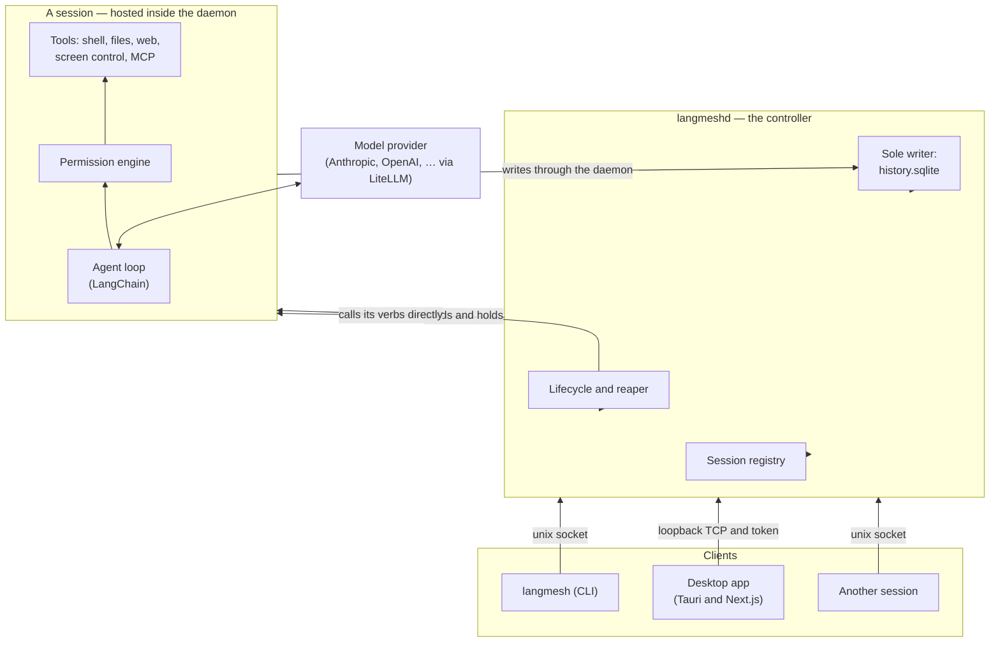

# Architecture

## The words this uses

Six terms carry most of the meaning here, and four of them are LangMesh's own.

| Term                    | What it means                                                                                                                                                                     |
| ----------------------- | --------------------------------------------------------------------------------------------------------------------------------------------------------------------------------- |
| **Session**             | One conversation with an agent. It is a durable record, and the daemon holds a live executor for it only while it is working.                                                     |
| **Turn**                | One exchange within a session: a message in, the model's work, and everything it said and did before it stopped. A session has many turns over its life.                          |
| **Harness**             | The code between the model and your machine — the turn loop, the tools, the prompts, the permissions. `langmesh.Session` is the harness, and everything else here is built on it. |
| **Control plane**       | The daemon's API. Every client reaches a session through it, so a caller is identified and scoped in exactly one place.                                                           |
| **Location**            | Where a session's tools actually run: this machine, or an SSH host. Distinct from its working directory, which is _where_ on that location.                                       |
| **Peer**                | A session created by another session. Not a special kind of thing — an ordinary session, addressed the way you address any session.                                               |
| **Workspace resources** | Location-owned files and databases behind a `WorkspaceResourcesLike` interface. The standard implementation is fsspec-backed and materializes a POSIX view for Bash.              |

[A2A](https://github.com/google/A2A) is Agent-to-Agent, Google's JSON-RPC protocol for one agent to call another. The daemon serves it for every session it hosts, so a peer and a person reach a session the same way.

## The four layers

Each layer uses the one below it and adds a single thing — the [documentation index](README.md) lists them, and what each one knows about your machine.

The bottom layer is the whole of the harness. A program can embed it and never start a daemon; see [As a library](library.md). Everything below in this document is what the three layers above add.

LangMesh is one executable entered two ways. `langmesh` is the command a person runs and `langmeshd` is the daemon that hosts the sessions.

They are the same image, not two binaries, for two reasons. Packaging stays a single specification, and every session runs inside the daemon, so the whole fleet carries the signed application bundle's code identity. One macOS Accessibility grant therefore covers everything, instead of prompting once per session.

## Sessions

A **session** is a durable record, with a live executor only while it is working. The harness creates it empty, then drives it by messages over its life. Creation and work are separate steps. You can therefore send the same session a second task, attach to it, and inspect it between them.

Being hosted is an activity, not the session. An idle session sleeps immediately: its executor is dropped, and its record and its conversation stay. The next message builds it a new one, in tens of milliseconds.

There is deliberately no linger window. An executor held alive for a message that may not come pays continuously to avoid paying occasionally, and rebuilding one is cheap. A session parked on a permission prompt is the clearest case: the suspension is already fully on disk, so holding anything for a person who may take hours buys nothing.

Two consequences follow. A daemon restart ends every session's _executor_ and no session at all. The harness derives the capability token from the session id; it does not store it. A woken session must get the same token that its creator got.

The daemon serves [A2A](https://github.com/google/A2A) (JSON-RPC) for every session it hosts, and every client reaches the daemon: the terminal, the desktop app, another session. There is therefore one place that identifies a caller, scopes it to its own subtree, and records it, and calling a session's verb is a direct call rather than a hop across a socket.

There is no in-process delegation: a session that needs a peer creates an ordinary session and messages it. See [Tools](tools.md#composing-with-other-sessions). A child appears in `langmesh ps`, can be attached to, and is reaped when its parent ends.

Isolation is a property of the executor and the context it runs in. An executor belongs to one session for the whole of its life, and the tool context is bound per task, so no path exists by which one session's state reaches another's. What sessions do share is the daemon's process: a native crash takes the daemon rather than one session. That is the price of a session costing a fraction of a millisecond instead of seconds.

## The daemon

`langmeshd` owns everything there can only sensibly be one of, and hosts the sessions themselves. It owns:

- the **registry** of sessions (identity, parent, permission mode, status);
- the **lifecycle**: building a session's executor, dropping it when the session sleeps, and reaping a subtree parent-last so a child never outlives its parent;
- the **databases**, as the sole writer — sessions persist through the daemon's ingest surface, so there is exactly one process writing SQLite;
- the shared **brokers**: events, terminals, file leases, workspaces, signed file URLs, push notifications, and remote agents — everything there can only sensibly be one of;
- the **sessions themselves**, each an executor it builds, holds and drops. Hosting them is why the daemon imports the runtime at boot: that import costs seconds, and paying it once at startup is what makes building a session cost a fraction of a millisecond.

It serves one API two ways:

- A **unix socket**, for the CLI and for sessions.
- A **loopback TCP port**, for the desktop client, which cannot open a unix socket from a webview. The port is ephemeral and chosen at boot; both listeners require the capability token the daemon writes `0600` into the runtime directory.

A token says a caller may drive the daemon; it does not say _who_ is calling, and on the unix socket that distinction is load-bearing. A session's own `bash` tool runs as the same user, and it can read that `0600` file. Attribution on tokens alone would therefore let a session present the daemon's token. It would then get a peer with no parent and no permission clamp.

The unix listener asks the kernel instead. `SO_PEERCRED` on Linux, or `LOCAL_PEERPID` on macOS, names the process that opened the connection. Every worker starts as a process-session leader, so `getsid` on that pid names the session it belongs to. That covers the worker itself, and every shell command and `langmesh` invocation underneath it.

That answer wins over the token. A session is therefore itself, whatever token it holds. A caller that the kernel places in no session stays unattributed, as it should: a person's terminal, or the desktop client. `langmesh kill` signals that same session id.

The two answers are one fact, read in two directions. What the kernel calls a session is what the harness attributes to it, and what it reaps with it. A caller can `setsid` itself, which leaves the session entirely. It stops being the session; it does not escape as the session. It is then no longer identified, no longer scoped, and no longer reaped.

## The CLI

`langmesh` adds nothing the control plane does not have — it is the ergonomic face of it. `create` a session and `send` it work. `ps` what runs, `attach` to watch, and `tree` to see what created what. `approve` a pending tool call, and `kill` a subtree. `remote` reaches an agent on another host, and `configure` sets what the next session starts with. The [CLI guide](cli.md) is the reference.

Everything goes to the daemon, `send` included — `langmesh` opens the daemon's unix socket and posts to `/rpc`, and the daemon relays to the owning session. One path, so a call is attributed and scoped in exactly one place whoever made it.

## The app

A [Tauri](https://tauri.app) shell around a [Next.js](https://nextjs.org) UI (static export; Chakra UI). It is a **client** — it holds no agent logic. It renders conversations, manages settings, and chooses which daemon to talk to.

It also holds no state of its own. Which workspace you were last in, the colour mode, the locale: all of it is the daemon's, read at startup and written back on change. Two windows onto one daemon therefore agree, and a client that has never run before opens on what the daemon already knows rather than on defaults.

Because a webview cannot open a unix socket, the app uses the daemon's loopback listener and the daemon relays data-plane commands to the owning session.

The app does not contain a daemon. For the default local connection, a release build asks the separately installed daemon bundle to start when nothing is listening, then reads the port and token that `langmeshd` publishes into the runtime directory. The daemon remains independent and outlives the window.

"Local" labels the daemon on this machine; it is not a different protocol. The daemon is a separate installable (`packaging/build-daemon.sh`), signed with the same identity as the app so the two share one macOS Accessibility grant. Both `langmesh app` and opening the release app directly ensure that local daemon is available without making it a child of the window.

## Connections: local, remote, SSH

A daemon's address and its token belong together. Each `langmeshd` mints its own token at boot, so a remote daemon does not accept the local one. A saved connection profile therefore carries both. The client resolves, in order:

1. a connection you activated in **Settings**, under **Connections** (its URL and its token), then
2. the endpoint the desktop shell reports for the local daemon, then
3. the runtime descriptor served with a browser development build, then
4. the build-time default `NEXT_PUBLIC_API_BASE`, then
5. the conventional local address.

That yields three ways to run:

- **Local (default).** The release app starts the separately installed daemon when needed, then reads the port and token that `langmeshd` published into the runtime directory.
- **Remote URL.** Run `langmeshd` on another host, expose its loopback port behind your own transport security, and add the URL plus the token. The app becomes a native front-end to a remote backend — the agent's shell, files, and network all live on that host.
- **Over SSH.** Add an SSH host. LangMesh forwards a local port to the daemon's port on the remote machine. The harness can therefore live on a machine you reach only over SSH, with nothing exposed.

For the last two, run `langmesh daemon endpoint` on that host: it reports the port and the token the connection needs.

Keeping the halves apart serves one goal: **put the compute, the files, and the credentials wherever they belong, and keep the interface native and local.**

## What a session has, and what it may reach

Two questions that look alike and are not. **May reach** is the confinement, above: an operating-system boundary around every tool child. **Has** is the session's toolbox — a package profile of its own on `PATH`, which it installs into itself.

Keeping them apart is the point. When one answer served both, a missing tool arrived as `Operation not permitted`, indistinguishable from a refused path, and an agent that cannot tell those apart treats the first as something to route around. With a toolbox, obtaining a tool always has an ordinary ending, so every refusal that remains is a real one — which makes the boundary sharper rather than weaker, and makes the log easier to read: "it tried to leave the workspace" is no longer buried under "it did not have `jq`".

The toolbox is per session and dies with it. Packages come out of the shared read-only store; the session owns only symlinks.

## Permissions

A session's permission mode is chosen when the session is created and can be changed while it runs — the change reaches the turn already in flight. A child gets a mode no looser than its parent's, and tightening a session tightens everything it created. There is no bypass mode and no standing "always allow"; the only runtime decisions are allow-once and deny. See [Security notes](../SECURITY.md).

## Request lifecycle (a message)

1. You send a message to a session. Every client posts to the daemon, which relays it to the session that owns it. A session mid-turn takes the message _into_ that turn at its next safe point; one parked on a decision takes nothing and says so, because starting a turn would discard the parked one.
2. The agent loop calls the model, which may request tool calls.
3. Each tool call is measured against the session's confinement. One that stays inside it runs. One that asks to reach past it is decided by the session's permission mode: under `ask` the session streams a permission request, which the CLI prints and `langmesh allow` or `langmesh deny` answers, or the app shows as an overlay; under `automatic` the reviewer answers it.
4. Approved tools then run:

- **Shell**, inside an OS-enforced confinement: `sandbox-exec` on macOS, Landlock on Linux. The harness resolves it when the session is created, and clamps it against the creator.
- **Files**, on the active location.
- **Screen control** (`control_screen`), against the local machine.
- **MCP**, against the session's own connections. Stateful connections and stdio subprocesses do not cross a process boundary, so a session connects its own rather than sharing the daemon's.

5. Results take two deliberately separate lanes. Every model text/reasoning delta is published synchronously to the daemon's in-process bounded event bus and reaches attached SSE clients without a timer, task allocation or database write; the browser coalesces only at its next paint. At semantic boundaries the accumulated content block is written once to `history.sqlite`, whose durable snapshot and compact live replay form one sequenced, gap-detecting attach protocol. Slow clients receive an explicit resync instead of consuming unbounded memory or silently losing text.
6. The turn ends when the model stops asking for tools — unless the session holds a **goal**, in which case a linked reviewer session independently inspects the work, decides whether the outcome is real, and writes what the session does next. See below.

An embedded session may source that entire location from any fsspec filesystem or `FSMap`. The resource lease materializes non-local data once for path-native tools, synchronizes completed tool batches transactionally where the backend supports transactions, and refreshes only at caller-chosen idle boundaries. Local change fan-out uses watchdog's public observer API; virtual and remote adapters expose provider-native events through `ResourceChangeSource`. There is deliberately no polling fallback and no attempt to virtualize Bash itself.

## Goals

A turn ends when the model stops talking. That is the wrong unit for work that was asked for as an outcome, because the model can stop for reasons that have nothing to do with the outcome being real.

So a session can hold one **goal**: the end state, what that end state is for, and the conditions that must hold for it to be true — all three written by the agent through `update_goal`, and all three durable beside the conversation.

**Setting a goal is the whole of the agent's authority over it.** It cannot satisfy one, clear one or declare one blocked. A session grading its own work is the failure this exists to prevent, and a session that can stop its own goal will stop it on the turn it gets tired.

Deciding where the goal stands is instead a **review**: an isolated agent session made when a turn ends. The interface reports “Checking the work” when independent review starts. The reviewer receives the main session's exact conversation, model and cached static prompt, the read-only subset of its configured tools, and one private verdict tool. Observational payloads are not injected; the compact descriptor and stable progressive-disclosure guidance let it retrieve only relevant current entries with read-only Bash and a disposable Semble index when needed. It is linked to the working session and visible in the dedicated goal-review panel, while remaining outside the ordinary session sidebar and working from a read-only workspace and disposable scratch directory. It forms its own critical opinion by reading the user's requests, searching the code, inspecting the diff, running non-mutating checks and probing suspicious results rather than grading the working agent's claims. Its final action is a structured `submit_goal_review` call naming the requirements it could not prove, whether the formal contract is complete, whether the goal is unmet, satisfied or blocked, and the exact next message when work remains. If the contract is incomplete, that message itself tells the working session to replace the goal through `update_goal`, preserves its existing purpose and minimum conditions, and names every condition to add; no second template reconstructs the review afterward.

The review is written to keep the work going. `unmet` is its ordinary answer; `satisfied` is deliberately rare and requires it to name what proves every requirement, establish that the contract needs no additions, and perform independent exploration proportionate to the change; `blocked` requires it to establish that no route is open and is rejected by the tool until the goal has already been pushed `Tunable.goal_blocked_turns` times. If the reviewer stops without submitting its verdict, the same linked session is instructed to continue and is asked again until it submits one. A provider or runtime failure still resolves nothing, and cancelling the parent session cancels the review.

Two bounds sit outside the review, since a reviewer biased toward continuing should not also be the only thing that can stop. `Tunable.goal_continuation_turns` is how many turns a session may open in a row with nobody watching; reaching it _parks_ the goal, which is neither abandoning it nor calling it stuck — the session simply waits, and anything anyone says gives the allowance back and picks the goal up where it stopped. And the goal is visible in the app above the composer, with a control that calls it off outright, which is the only thing that ever _clears_ one: the person whose goal it was.

What opens those turns is the layer that owns the session. For an unmet goal, the review's generated message and review identifier are one durable pair, sent as the next turn, consumed together when that turn opens, and streamed immediately through the same inbound-message event used by peer and human messages. The chat renders it once as a user-shaped card labelled “Relayed from the goal review agent,” whose review action opens the exact linked transcript. Live attachment and replay use the same reducer and stable message identity, so a refresh cannot be required to reveal it or create a duplicate. The working agent sees that message and nothing else from the verdict—not the assessment, contract judgment, or counting. A satisfied or blocked verdict opens no continuation message; its evidence or blocker belongs to the goal's resolved state instead.

## Prompt caching, and what is recorded about it

Every provider here bills a cached prefix at a fraction of a fresh one, and a conversation is almost entirely prefix: the system prompt, the tool schemas, and every turn that came before. So a session's cost is decided less by what it does than by whether the request it sends still matches the one before it. Two rules follow, and the harness holds both.

**The persisted conversation is append-only until compaction.** Each ordinary call adds to its end and rewrites nothing, while instructions and tool schemas stay stable for the session. At the recommended threshold, one private append-only notice exposes only local Bash and requires the main agent to atomically update the active workspace's current-state `.agents/observations.sqlite`; a revision-only transaction is the explicit “nothing durable” acknowledgement. LangMesh verifies that `registry_meta.revision` advanced, then compaction drops the old head and resumes the accepted work. No observational record is inferred, injected, or consolidated in the background. Git supplies registry history, while explicit user invocation of `consolidate-observations` rewrites current state by merging, updating, and deleting rows.

That placement was learned from the measurement below. Per-turn context, checklists, environment notices and observational snapshots used to be appended whenever the user sent a message. They moved the prefix and mixed harness prose into the transcript. Stable session and environment context now live in the system prompt, while observational payloads stay outside it. The prompt carries only a compact registry descriptor and discovery protocol: retrieve relevant current rows on demand, preferably by exporting minified JSONL and searching it with a fresh disposable Semble index. Ordinary user sends append no reminder messages.

The only intentional prefix invalidation is compaction, which replaces the conversation head and rebuilds the system prompt once so session context and the observational-memory descriptor can refresh. That is the point of it, and it is why provider-native reasoning is dropped at the same boundary. The rebuilt prompt still contains no observation payloads.

The registry's live path is event-driven. The daemon installs one native filesystem subscription per active workspace/location before its first read, coalesces only notifications already queued, then reads revision and rows exactly once from one read-only SQLite snapshot off the event loop. It never polls, sleeps, or retries a guessed delay. Every mutation publishes a fully closed and validated sibling database with `os.replace`; the event therefore names a complete state that is safe to read. The daemon validates the exact schema and every payload and publishes the full current snapshot only when it changed. Full snapshots make deletion, replacement, and repair naturally consistent on every client. A persistent error preserves the last good view, appears in the panel, and is queued as one private reminder for each live agent's next model-call opening. Repair clears the queued error without inventing a user turn.

**The cache is asked for by name.** A provider does not keep one global store; it routes a lookup by hashing the head of the prefix _together with_ a key, so requests that share a key land where their prefix is. Every provider is sent `prompt_cache_key` set to the session id — one session is one conversation is one prefix. Claude additionally gets explicit `cache_control` breakpoints, two at the front over the tools and prompt and two at the moving end, since Anthropic caches nothing unless asked.

That still leaves the question a bill cannot answer. A provider serves the longest prefix it recognises, so a low cache read is either a request that stopped matching — in which case something here moved it — or one that matched and was not served, which nothing here can fix. Those want opposite responses and look identical from the outside.

So every model call records how it compared to the one before it. The request is cut into the segments the wire is built from — the instructions, the tool schemas, then one per conversation item — and each is digested and counted; the next call's segments are compared against them. `langmesh.runtime.cache_trace` does the measuring and both model adapters carry it.

| Recorded on each `token_usage` event    | What it says                                                                                                                                                                      |
| --------------------------------------- | --------------------------------------------------------------------------------------------------------------------------------------------------------------------------------- |
| `timestamp`                             | When the call happened, ISO-8601 UTC. Every streamed event carries one — the transcript's order says what came next, never how long after, and a prompt cache goes cold with time |
| `input_tokens`, `output_tokens`         | The call's own size, not a running total                                                                                                                                          |
| `cache_read_tokens`, `reasoning_tokens` | The call's own cache read and reasoning spend                                                                                                                                     |
| `prefix_intact`                         | Whether every segment shared with the previous call was unchanged                                                                                                                 |
| `reachable_tokens`                      | Tokens of unchanged prefix — the ceiling `cache_read_tokens` is measured against. An estimate: counted with this harness's tokenizer, not the provider's                          |
| `segments`, `shared_segments`           | The same comparison in pieces rather than tokens                                                                                                                                  |
| `divergence`                            | When the prefix moved: `index`, the segment `current` and `previous` (each a `kind`, `position` and `role`), and `rewritten` — the piece stayed in place and its contents changed |
| `cumulative`                            | Session-lifetime totals, as before                                                                                                                                                |

Recorded rather than logged, because the question is asked days later of a particular call in a particular session, and only stored data answers that. The events live in `history.sqlite` beside the transcript and replay with it, so a past session can be audited as readily as a running one.

Reading them together is what makes a diagnosis. `prefix_intact` true with `cache_read_tokens` at zero means the provider was handed bytes it had already been sent and returned nothing for them — routing, not the request, and no differently shaped request would help. A `divergence` with `rewritten` true is the opposite: something here rewrote a message in place, and the `position` and `role` say which.

Two caveats when querying. The first call of a session has nothing to compare against and always reports `prefix_intact` false, as does the first call after a worker restart, since the comparison lives on the model object; filter on `shared_segments > 0` to exclude them. And `reachable_tokens` can exceed `input_tokens` by a few percent, because the two are counted with different tokenizers — a _large_ disagreement is itself worth looking at.

## Where to go next

- Configure providers and behavior: [Configuration guide](configuration.md).
- Author agents, skills, memory, and MCP servers: [Agent system guide](agent-system.md).
- The tool surface in detail: [Tools guide](tools.md).
