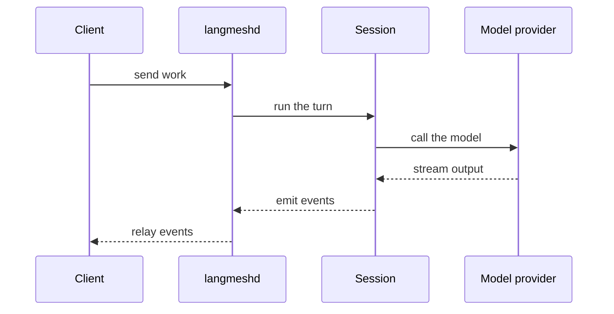

# Architecture

## The words this uses

| Term                    | What it means |
| ----------------------- | ------------- |
| **Session**             | One conversation with an agent. A durable record; the daemon holds a live executor for it only while it works. |
| **Turn**                | One exchange within a session: a message in, the model's work, and everything it said and did before stopping. |
| **Harness**             | The code between the model and your machine: the turn loop, tools, plugins, prompts, permissions. `langmesh.Session` is the harness. |
| **Feature** (plugin)    | A replaceable sub-behavior composed onto the core — a tool, goal review, compaction, permissions. The core names none of them. |
| **Control plane**       | The daemon's RPC/API. Every client reaches a session through it, so a caller is identified and scoped in one place. |
| **Location**            | Where a session's tools actually run: this machine, or an SSH host. Distinct from the working directory, which is where on that location. |
| **Peer**                | A session created by another session. Not a special kind of thing, an ordinary session. |
| **Workspace resources** | Location-owned files and databases behind a `WorkspaceResourcesLike` interface. The standard implementation is fsspec-backed and materializes a POSIX view for Bash. |

[A2A](https://github.com/google/A2A) is Agent-to-Agent, Google's JSON-RPC protocol for one agent to call another. The daemon serves it for every session it hosts, so a peer and a person reach a session the same way.

## Two packages, one image

LangMesh is two Python packages that ship together as one image. The **library** (`src/langmesh`) is the harness: `langmesh.Session` drives an agent turn by turn in your process. It reads no machine configuration, starts nothing, and composes nothing you did not hand it — every tool and sub-behavior is a feature. The **product** (`src/langmeshd`) is everything that makes sessions durable and addressable: the machine loaders that turn your `.agents` trees into what the library takes, the daemon that hosts sessions, the CLI, the REST surface, dictation, and the worker machinery. The library never imports the product; the product hosts the library.

The product is one executable entered two ways. `langmesh` is the command a person runs (whose one verb is `serve`); `langmeshd` is the daemon that hosts sessions. They are the same image, not two binaries, so packaging stays a single specification and every session carries the signed bundle's code identity. One macOS Accessibility grant covers the whole fleet instead of prompting per session.

## The feature seam

A session runs a plain model turn by itself. Everything else is a feature: goal review, compaction, permission gating, automatic permission review, autonomous continuation, observational memory, background jobs, work habits, session naming, locations, and every tool from `bash` to `control_screen`. Composition is the caller's choice, never a library default. The daemon builds its bundle explicitly in `langmeshd.features`; an embedder builds its own. See [Composition](../library/composition.md).

## Sessions

- **Being hosted is an activity, not the session.** An idle session sleeps immediately: its executor is dropped, and its record and conversation stay. The next message builds a new one in tens of milliseconds.
- **There is no linger window.** An executor held alive for a message that may not come pays continuously to avoid paying occasionally, and rebuilding one is cheap. A session parked on a permission prompt is the clearest case: the suspension is already fully on disk, so holding anything for a person who may take hours buys nothing.
- **A daemon restart ends executors, never sessions.** The harness derives the capability token from the session id (HMAC over a master key); it does not store it, so a woken session gets the same token its creator got.
- The daemon serves A2A (JSON-RPC) for every session it hosts, and every client reaches the daemon: the terminal, the desktop app, another session. There is one place that identifies a caller, scopes it to its own subtree, and records it.
- **There is no in-process delegation.** A session that needs a peer creates an ordinary session and messages it. See [Composing with other sessions](../user/agent-system.md#peer-sessions). A child appears as delegated work in the app and is reaped when its parent ends.
- **The worker is not a separate process.** Each live session is an executor inside the daemon. Sessions share the daemon's process, so a native crash takes the daemon rather than one session — that is the price of a session costing a fraction of a millisecond to build and sleep. Isolation is a property of the executor and the context it runs in: one session's state cannot reach another's.

## The daemon

`langmeshd` owns everything there can only sensibly be one of, and hosts the sessions. It owns:

- The **registry** of sessions (identity, parent, permission mode, status, lifecycle);
- The **lifecycle**: building a session's executor, dropping it when the session sleeps, and reaping a subtree parent-last;
- The **databases**, as the sole writer, so exactly one process writes SQLite (`history.sqlite` and `background.sqlite`);
- The shared **brokers**: events, terminals, file leases, workspaces, signed file URLs, push notifications, MCP servers, remote agents, Composio;
- The **sessions themselves**, each an executor it builds, holds, and drops. Hosting them is why the daemon imports the runtime at boot: that import costs seconds, and paying it once makes building a session cost a fraction of a millisecond;
- Launched **workers** only for the heavyweight, disposable pieces — the dictation transcriber, a backgrounded process group — never for a session.

It serves one API two ways:

- A **unix socket**, for the CLI and for sessions;
- A **loopback TCP port**, for the desktop client, which cannot open a unix socket from a webview. The port is ephemeral and chosen at boot; both listeners require the capability token the daemon writes `0600` into the runtime directory.

A token says a caller may drive the daemon; it does not say who is calling, and on the unix socket that distinction is load-bearing. A session's own `bash` tool runs as the same user and can read that `0600` file, so attribution on tokens alone would let a session present the daemon's token and get a peer with no parent and no permission clamp.

The unix listener asks the kernel instead: `SO_PEERCRED` on Linux, or `LOCAL_PEERPID` on macOS, names the process that opened the connection. Every worker starts as a process-session leader, so `getsid` on that pid names the session it belongs to, covering the executor and every shell command underneath it. That answer wins over the token: a session is itself, whatever token it holds. A caller the kernel places in no session stays unattributed, as it should: a person's terminal, or the desktop client. That same session id is how the harness ends a session's work.

The two answers are one fact read in two directions. What the kernel calls a session is what the harness attributes to it, and what it reaps with it.

## The CLI

`langmesh` adds nothing the control plane does not have; its one verb, `serve`, makes the interface available over HTTP with the daemon behind it. It is a reverse proxy in front of the daemon plus a static interface server: the browser page never sees the daemon's capability token. `serve` starts the daemon if it is not running and stops a daemon it started, leaving a pre-existing daemon alone. With `--reach` it adds a token-gated pairing door for your own devices. The [CLI guide](../user/installation.md) is the reference.

Everything a person does — creating and messaging sessions, answering permission requests, schedules, configuration, sign-in — happens in the interface or over the daemon's API, never through CLI verbs.

## The app

A [Tauri](https://tauri.app) shell around a [Next.js](https://nextjs.org) UI (static export; Chakra UI). It is a **client**: it holds no agent logic, renders conversations, manages settings, and chooses which daemon to talk to.

- It holds little state of its own. The workspace you were last in, the colour mode, the locale: the durable preferences are the daemon's, read at startup and written back on change. Two windows onto one daemon agree, and a client that never ran before opens on what the daemon already knows.
- Because a webview cannot open a unix socket, the app uses the daemon's loopback listener.
- The app does not contain a daemon. For the default local connection, a release build asks the separately installed daemon bundle to start when nothing is listening, then reads the port and token that `langmeshd` publishes into the runtime directory. The daemon remains independent and outlives the window.
- The daemon is a separate installable (`packaging/build-daemon.sh`), signed with the same identity as the app so the two share one macOS Accessibility grant.
- A phone is an Expo client that opens the same web interface in a WebView and adds the two things a page alone cannot do: reading the `langmesh://pair#…` pairing code with the camera, and keeping its token in the keychain. The shared UI and catalogue live in `shared/`.

## Connections: local, remote, SSH

A daemon's address and its token belong together. Each `langmeshd` mints its own token at boot, so a remote daemon does not accept the local one. A saved connection profile therefore carries both. The client resolves, in order:

1. a connection/machine you activated in **Settings, then Connection** (its URL and its token),
2. the endpoint the desktop shell reports for the local daemon,
3. the build-time default `NEXT_PUBLIC_API_BASE`,
4. the conventional local address.

That yields three ways to run:

- **Local (default).** The release app starts the separately installed daemon when needed, then reads the port and token `langmeshd` published into the runtime directory.
- **Remote URL.** Run `langmeshd` on another host, expose its loopback port behind your own transport security, and add the URL plus the token. The app becomes a native front end to a remote backend; the agent's shell, files, and network all live on that host.
- **Over SSH.** Add an SSH host as a location. LangMesh forwards a local port to a command channel on the remote machine, so the harness can work on a machine you reach only over SSH while the daemon stays local.

Keeping the halves apart serves one goal: **put the compute, the files, and the credentials wherever they belong, and keep the interface native and local.**

## What a session has, and what it may reach

Two questions that look alike and are not. **May reach** is the confinement: an operating-system boundary around every tool child. **Has** is the session's toolbox: a package profile of its own on `PATH`, which it installs into itself.

Keeping them apart is the point. When one answer served both, a missing tool arrived as `Operation not permitted`, indistinguishable from a refused path, and an agent that cannot tell them apart treats the first as something to route around. With a toolbox, obtaining a tool always has an ordinary ending, so every refusal that remains is a real one. The toolbox is per session and dies with it: packages come out of the shared read-only store, and the session owns only symlinks.

## Permissions

A session's permission mode is chosen when the session is created and can change while it runs; the change reaches the turn already in flight. The modes are `ask`, `automatic`, and `allow`. A child gets a mode no looser than its parent's, and tightening a session tightens everything it created; `ask` is the most restrictive, and an unattended session (`automatic` or `allow`) can only create sessions that also run unattended. See the [security policy](https://github.com/ghovax/langmesh/blob/main/SECURITY.md).

## Request lifecycle

1. You send a message to a session. Every client posts to the daemon, which relays to the owning session. A session mid-turn takes the message into that turn at its next safe point; one parked on a decision takes nothing and says so, because starting a turn would discard the parked one.
2. The agent loop calls the model, which may request tool calls.
3. Each tool call is measured against the session's confinement. One that stays inside it runs. One that asks to reach past it is decided by the session's permission mode: under `ask` the session streams an overlay to answer; under `automatic` the reviewer answers; under `allow` the gate is skipped entirely and the call runs.
4. Approved tools then run: shell inside an OS-enforced confinement (`sandbox-exec` on macOS, Landlock on Linux), files on the active location, screen control against the local machine, and MCP servers through the session's own connections.
5. Results take two deliberately separate lanes:
   - Every model text and reasoning delta is published synchronously to the daemon's in-process bounded event bus and reaches attached SSE clients without a timer or database write. At semantic boundaries the accumulated content block is written once to `history.sqlite`.
   - History streams complete compacted turns continuously from newest to oldest through a durable high-water mark, while live events preempt history work. The browser prepends each turn once with stable identities, so opening cost is independent of conversation length and replay is linear.
   - Model-facing tool results follow the same separation: the required contiguous `ToolMessage` block carries only execution data; timing and lifecycle metadata live in LangChain artifacts that providers never receive; explanatory guidance is appended afterward as a distinct hidden reminder. No prior message is rewritten, so reviewer branches and later turns retain the exact provider-cache prefix.
6. The turn ends when the model stops asking for tools, unless the session holds a **goal**, in which case the goal feature drives an independent review.

An embedded session may source its entire location from any fsspec filesystem or `FSMap`. The resource lease materializes non-local data once for path-native tools, synchronizes completed tool batches transactionally where the backend supports transactions, and refreshes only at caller-chosen idle boundaries. Change fan-out uses native notifications: watchdog's public observer API locally, provider-native events through `ResourceChangeSource` elsewhere. There is deliberately no polling fallback and no attempt to virtualize Bash itself.

## Goals

A turn ends when the model stops talking. That is the wrong unit for work asked for as an outcome, because the model can stop for reasons that have nothing to do with the outcome being real.

So a session can hold one **goal**: the end state, what the end state is for, and the conditions that must hold for it to be true. All three are written by the agent through `update_goal`, and all three are durable beside the conversation. The goal is a plugin feature.

- **Setting a goal is the whole of the agent's authority over it.** It cannot satisfy one, clear one, or declare one blocked. A session grading its own work is the failure this exists to prevent.
- **Deciding where the goal stands is a review**: an isolated agent session made when a turn ends. The reviewer receives the main session's exact conversation, model, and cached static prompt, while runtime policy narrows execution to read-only work. Its verdict tool, `submit_goal_review`, is granted to it like any session tool: dispatchable, and described by an appended conversation message rather than by schema binding, so the provider-cache prefix is untouched.
- The reviewer is linked to the working session and visible in the dedicated goal-review panel, working from a read-only workspace and disposable scratch directory. It forms its own opinion by reading the user's requests, searching the code, inspecting the diff, running non-mutating checks, and probing suspicious results rather than grading the working agent's claims.
- Its final action is a structured `submit_goal_review` call naming the requirements it could not prove, whether the formal contract is complete, whether the goal is unmet, satisfied, or blocked, and the exact next message when work remains. The tool accepts the verdict on any review, gated only by the reviewer's own evidence. If the reviewer stops without submitting, it is asked again until it does. Cancelling the parent session cancels the review.
- **`review` mode is the default; `self_managed` skips the reviewer** and simply re-prompts the agent on the goal itself. In either mode, `goal_continuation_turns` bounds how many turns a session may open in a row with nobody watching; reaching it parks the goal, neither abandoning it nor calling it stuck. And the goal is visible in the app above the composer, with a control that calls it off outright, which is the only thing that ever clears one.

For an unmet goal, the review's generated message and review identifier are one durable pair, sent as the next turn, consumed together when that turn opens, and streamed immediately. The chat renders it once as a user-shaped card labelled "Relayed from the goal review agent," whose review action opens the exact linked transcript. The working agent sees that message and nothing else from the verdict.

Tracked tasks have their own continuation obligation and allowance. At the completed-turn boundary, the session derives one plan containing the independent goal and tasks reasons. One owned workflow drains those plans under the session's turn lock: it reviews the goal first, then compacts the hidden unfinished-task audit into the review's continuation message, or opens a task-only reminder turn when the review produces no next message. This makes competing automatic turns structurally impossible while letting either mechanism operate without the other.

## Prompt caching, and what is recorded about it

Every provider bills a cached prefix at a fraction of a fresh one, and a conversation is almost entirely prefix: the system prompt, the tool schemas, and every turn that came before. A session's cost is decided less by what it does than by whether the request it sends still matches the one before it. Two rules follow, and the harness holds both.

**The persisted conversation is append-only until compaction.** Each ordinary call adds to its end and rewrites nothing, while instructions and tool schemas stay stable for the session. At the recommended threshold, one private append-only notice exposes only local Bash and requires the main agent to atomically update the active workspace's current-state `.agents/observations.sqlite`; a revision-only transaction is the explicit "nothing durable" acknowledgement. LangMesh verifies that `registry_meta.revision` advanced, then compaction drops the old head and resumes the accepted work.

- That placement was learned from measurement. Per-turn context, checklists, environment notices, and observational snapshots used to be appended whenever the user sent a message. They moved the prefix and mixed harness prose into the transcript. Stable session and environment context now live in the system prompt, while observational payloads stay outside it.
- **The only intentional prefix invalidation is compaction**, which replaces the conversation head and rebuilds the system prompt once so session context and the observational-memory descriptor can refresh. Provider-native reasoning is dropped at the same boundary.
- The registry's live path is event-driven. The daemon installs one native filesystem subscription per active working directory before its first read, then reads revision and rows exactly once from one read-only SQLite snapshot off the event loop. It never polls, sleeps, or retries a guessed delay. Every mutation publishes a fully closed and validated sibling database with `os.replace`, so the event names a complete state that is safe to read.

**The cache is asked for by name.** A provider does not keep one global store; it routes a lookup by hashing the head of the prefix together with a key, so requests that share a key land where their prefix is. Every provider is sent `prompt_cache_key` set to the session id, because one session is one conversation is one prefix. The bound tool schema is fixed at session creation and never changes: a tool granted later is described by an appended conversation message instead, so the prefix holds at any moment. Permission review, goal review, and compaction append their private instructions only after the main conversation prefix, and they keep using the same provider key, so auxiliary calls can advance independently without invalidating the ordinary turn that follows. Claude additionally gets explicit `cache_control` breakpoints.

A provider serves the longest prefix it recognises, so a low cache read is either a request that stopped matching or one that matched and was not served. Those want opposite responses and look identical from the outside. So every model call records how it compared to the one before it: the request is cut into the segments the wire is built from, each is digested and counted, and the next call's segments are compared against them. `langmesh.runtime.cache_trace` does the measuring and both model adapters carry it.

| Recorded on each `Usage` event             | What it says |
| ------------------------------------------ | ------------ |
| `input_tokens`, `output_tokens`            | The call's own size, not a running total. |
| `cache_read_tokens`, `cache_write_tokens`  | The provider's actual cache reads and writes for this call. |
| `reasoning_tokens`                        | The call's reasoning spend. |
| `cache_prefix_reusable`                   | Whether the preceding request is a complete prefix of this one; unknown without a local baseline. |
| `reusable_prefix_tokens`                  | Tokens of locally reusable prefix, the denominator for cache-read coverage. An estimate, counted with this harness's tokenizer. |
| `segments`, `shared_segments`              | The same comparison in pieces rather than tokens. |
| `divergence`                               | When the prefix moved: the segment index, the current and previous segment, and whether it was rewritten in place. |
| `cumulative`                               | Session-lifetime totals. |

Reading them together is what makes a diagnosis:

- `cache_prefix_reusable` true with `cache_read_tokens` at zero means the provider was handed bytes it had already been sent and returned nothing for them: routing, not the request.
- A `divergence` with `rewritten` true is the opposite: something here rewrote a message in place.
- The first call in a lane and the first call after a worker restart report `cache_prefix_reusable` as unknown because there is no local baseline; provider-reported reads and writes remain authoritative.
- `reusable_prefix_tokens` can exceed `input_tokens` by a few percent, because the two are counted with different tokenizers; a large disagreement is worth looking at.

## Where to go next

- Configure providers and behavior: [Configuration guide](../user/configuration.md).
- Author agents, skills, memory, and MCP servers: [Agent system guide](../user/agent-system.md).
- The tool surface in detail: [Tools guide](../user/agent-system.md).
